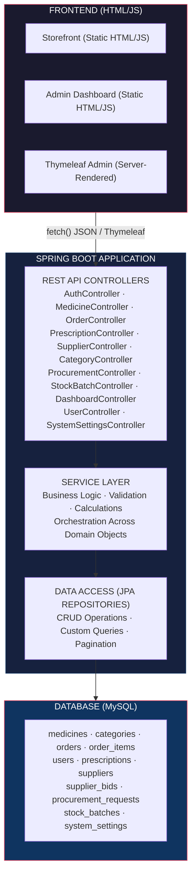
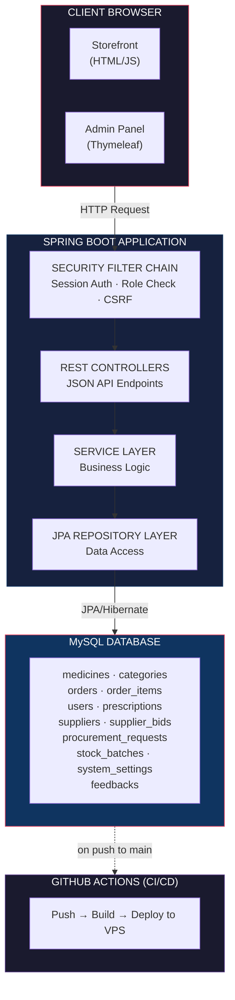

  

  # MediMart – Online Medical Store

  **Clinical Sophistication & Care**

  

    
    
    
    
    
  

   

---

**MediMart** is a full-stack pharmacy e-commerce and inventory management system developed as a **mini-project** for the **1st Year, 2nd Semester** module **Object-Oriented Programming (OOP)**, under the **Information Technology degree pathway** at **Sri Lanka Institute of Information Technology (SLIIT)**.

The project focuses on building a complete online pharmacy platform that handles medicine catalog browsing, prescription management, order processing, stock control, supplier management, and procurement with bidding — all while demonstrating core OOP principles such as **inheritance, polymorphism, encapsulation, and abstraction** throughout the domain models.

---

## Live Website

🔗 [https://medimart.randillasith.me/](https://medimart.randillasith.me/)

---

## Project Objectives

- Build a functional **online pharmacy storefront** where customers can browse and purchase medicines
- Implement a **prescription management system** for uploading, verifying, and tracking prescriptions
- Develop a **full admin dashboard** for inventory control, order processing, and system configuration
- Create a **supplier procurement system** with bidding capabilities for stock replenishment
- Track **stock batches** with expiry dates for quality and safety compliance
- Demonstrate practical use of **OOP concepts** — inheritance, polymorphism, encapsulation, and abstraction
- Provide **role-based access control** for customers, suppliers, and administrators
- Enable **auto-deployment** via CI/CD pipeline (GitHub Actions → VPS)

---

## System Overview

**How it works:**

1. **Customers** browse the medicine catalog and add items to their cart
2. **Prescriptions** can be uploaded for medicines that require doctor approval
3. **Orders** are placed with shipping details and delivery fee calculation
4. **Admins** manage inventory, process orders, and verify prescriptions via the dashboard
5. **Suppliers** participate in procurement requests by submitting bids
6. **Stock batches** are tracked individually with expiry dates and purchase prices
7. **System settings** (tax rates, fees, thresholds) are configurable at runtime

---

## System Architecture Diagram

The diagram above illustrates the overall architecture of the MediMart Pharmacy Management System, showing how the frontend communicates with the Spring Boot backend via REST APIs, which processes business logic through the service layer, persists data to the MySQL database via JPA repositories, and is automatically deployed through a GitHub Actions CI/CD pipeline.

---

## OOP Concepts Demonstrated

| Concept | Implementation |
|---|---|
| **🔷 Inheritance** | `Medicine` → `OTCMedicine` — OTC extends base Medicine with specialized pricing `AbstractSupplier` → `Supplier` — shared base with polymorphic supply display |
| **🔶 Polymorphism** | `Medicine.getFinalPrice()` — OTC returns `price × 1.10`, base returns price `Supplier.getSupplierCategory()` — different lead times per type (LOCAL=3d, IMPORTED=14d, GOVERNMENT=30d) |
| **🔷 Encapsulation** | All entity fields are private with controlled public getters/setters Business logic is hidden in Service layer, data access in Repository layer |
| **🔶 Abstraction** | Controllers know *what* services do, not *how* they do it Services hide database complexity behind clean method signatures |

---

## Tech Stack

| Layer | Technology |
|---|---|
| **Backend** | Java 17, Spring Boot 4.0.5, Spring Data JPA, Spring Security, Spring Validation |
| **Frontend** | HTML5, Tailwind CSS (CDN), JavaScript (fetch API), Thymeleaf (admin templates) |
| **Database** | MySQL 8.0 |
| **Build** | Maven, Lombok |

---

## Key Features

| Module | Features |
|---|---|
| 🛒 **Storefront** | Catalog browsing, search, cart, checkout, prescription upload |
| 🔐 **Authentication** | Session-based login/register, BCrypt password hashing, role-based access |
| ⚕️ **Prescriptions** | Image upload, admin verification, PENDING→APPROVED/REJECTED workflow |
| 📊 **Admin Dashboard** | Revenue, order stats, low stock alerts, user counts, recent orders |
| 📦 **Inventory** | Medicine CRUD, SKU generation, soft delete, image upload |
| 📋 **Orders** | Full lifecycle (PENDING→PROCESSING→SHIPPED→DELIVERED/CANCELLED) |
| 📦 **Stock Batches** | Batch tracking, expiry dates, purchase price per batch |
| 🤝 **Suppliers** | CRUD with LOCAL/IMPORTED/GOVERNMENT types and lead times |
| 💰 **Procurement** | Requests with target prices, supplier bidding, bid acceptance |
| ⚙️ **Settings** | Tax rates, delivery fees, low stock threshold, maintenance mode |

---

## API Endpoints

| Method | Path | Description | Access |
|---|---|---|---|
| `POST` | `/api/auth/register` | Create account | Public |
| `POST` | `/api/auth/login` | Sign in | Public |
| `GET` | `/api/medicines/storefront` | Browse catalog | Public |
| `POST` | `/api/orders` | Place order | Public |
| `GET` | `/api/dashboard/metrics` | Admin metrics | Admin |
| `POST` | `/api/medicines` | Add medicine | Admin |
| `POST` | `/api/prescriptions` | Upload prescription | Authenticated |
| `POST` | `/api/procurement/requests` | Create procurement | Admin |
| `POST` | `/api/procurement/bids` | Submit supplier bid | Supplier |

*Full API reference with all endpoints is available in the [complete source code](https://github.com/randillasith/MediMart).*

---

## Wiki

📖 Detailed documentation is available on the [MediMart Wiki](https://github.com/randillasith/MediMart/wiki) including:

- 🚀 [Getting Started](https://github.com/randillasith/MediMart/wiki/Getting-Started) — Setup guide
- 🏗️ [Architecture](https://github.com/randillasith/MediMart/wiki/Architecture) — System design
- 📡 [API Reference](https://github.com/randillasith/MediMart/wiki/API-Reference) — All endpoints
- 🧱 [OOP Concepts](https://github.com/randillasith/MediMart/wiki/OOP-Concepts) — Code examples
- 🗄️ [Database Schema](https://github.com/randillasith/MediMart/wiki/Database-Schema) — Table structures
- 🔐 [Security](https://github.com/randillasith/MediMart/wiki/Security) — Auth flow
- ☁️ [Deployment](https://github.com/randillasith/MediMart/wiki/Deployment) — CI/CD

---

## License

This project is licensed under the MIT License — see the [LICENSE](LICENSE) file for details.

